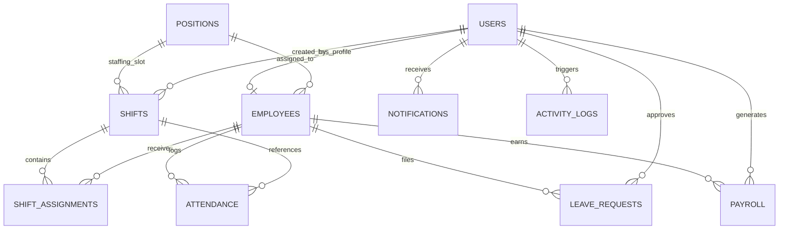
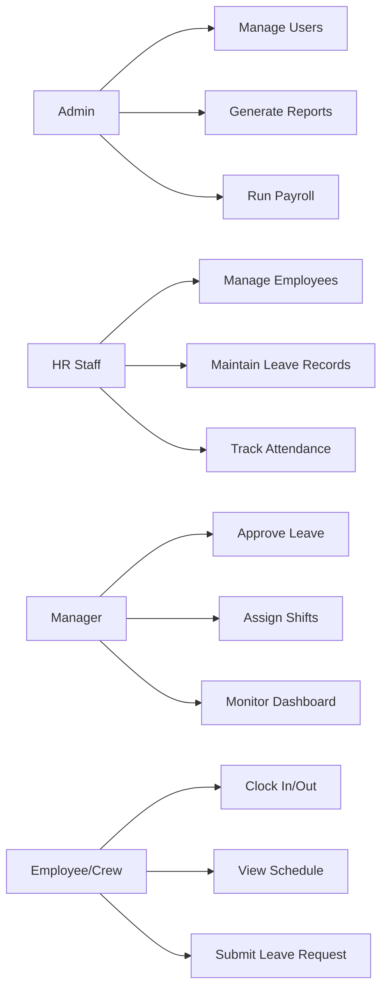
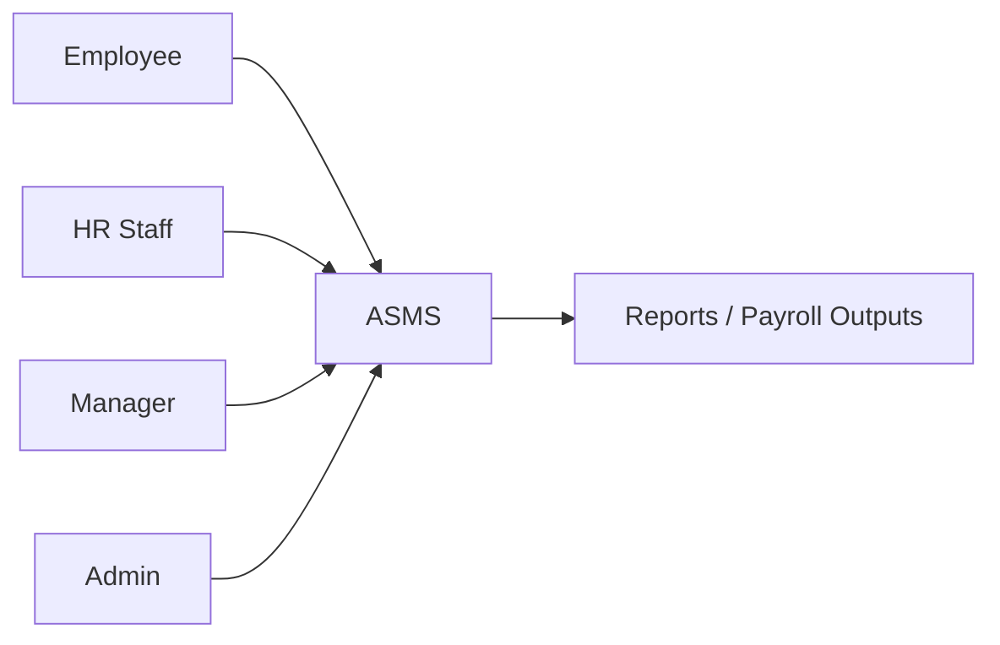
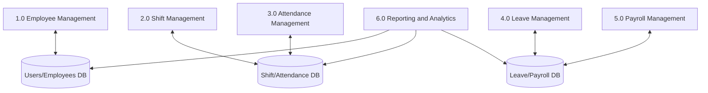

# ASMS Teacher Submission Pack

## 1. Project Scope
Attendance with Shifting Management System (ASMS) is a desktop (WPF + EF Core + MySQL) system for employee attendance, shift planning, leave handling, payroll support, and audit tracking.

## 2. Core Functionalities Matrix
| Module | Key Functions | Current Project Status |
|---|---|---|
| User and Role Management | Login/logout, role-based UI access, account CRUD | Implemented (`AuthService`, `UsersPage`, `UserDialogWindow`) |
| Employee Management | Employee profile CRUD, status, position assignment | Implemented (`EmployeesPage`, `EmployeeDialogWindow`) |
| Attendance Management | Time-in/out, daily status, overtime hours | Implemented (`AttendanceService`, `AttendanceStatusService`) |
| Shift Management | Schedule creation, assignment, weekly planning | Implemented (`ShiftsManagementPage`, `WeeklyCalendarPage`, `AutoSchedulingService`) |
| Leave and Requests | Leave filing, approval/rejection, balances | Implemented (`LeaveRequestPage`, `LeaveApprovalPage`, `LeaveService`) |
| Payroll | Hours aggregation and payroll generation | Implemented (`PayrollService`, `PayrollPage`) |
| Reporting and Analytics | Dashboard KPIs, attendance tables, labor-hour summary | Implemented (dashboard view models), export can be extended |
| Notifications | Shift/leave/general notifications | Implemented (`NotificationService`) |
| Security and Compliance | Password hashing, audit logs, role segregation | Implemented (`BCrypt`, `ActivityLog`, role-based commands) |
| Optional Integrations | Biometrics/QR/RFID, mobile app | Planned extension |

## 3. ERD (Textual + Diagram)
### Core Relationships
- `users (1) -> (0..1) employees`
- `positions (1) -> (many) employees`
- `positions (1) -> (many) shifts`
- `shifts (1) -> (many) shift_assignments`
- `employees (1) -> (many) shift_assignments`
- `employees (1) -> (many) attendance`
- `shifts (1) -> (many) attendance`
- `employees (1) -> (many) leave_requests`
- `users (1) -> (many) leave_requests` via `approved_by`
- `employees (1) -> (many) payroll`
- `users (1) -> (many) payroll` via `generated_by`
- `users (1) -> (many) activity_logs`
- `users (1) -> (many) notifications`

### Mermaid ERD

## 4. SQL Database Design
- Full schema script: `docs/asms_schema.sql`
- DB engine: MySQL 8+
- Constraints: PK/FK + unique indexes for `employees.user_id`, `shift_assignments(shift_id, employee_id)`, `user_profiles.user_id`, `user_preferences.user_id`

## 5. Use Case Diagram (Textual)
### Actors
- Admin
- HR Staff
- Manager
- Employee/Crew

### Major Use Cases
- Admin: manage users, employees, positions, holidays, payroll, reports
- HR Staff: maintain employee records, assist shift plans, review attendance and leave
- Manager: approve leave, publish announcements, monitor live attendance, schedule teams
- Employee/Crew: clock in/out, view shifts, request leave, receive notifications

### Mermaid Use-Case Style View

## 6. Data Flow Diagram (DFD)
### Level 0 (Context)

### Level 1

## 7. Adviser-Friendly Enhancements
### RBAC Matrix
| Function | Admin | HR Staff | Manager | Employee/Crew |
|---|---|---|---|---|
| User account administration | Yes | Limited | No | No |
| Employee profile management | Yes | Yes | Limited | Self-view |
| Shift assignment | Yes | Yes | Yes | View own |
| Attendance monitoring | Yes | Yes | Yes | Own record |
| Leave approval | Yes | Yes | Yes | Request only |
| Payroll processing | Yes | Yes | No | View own summary |
| Audit/report access | Yes | Yes | Limited | No |

### Shift Scheduling Workflow
1. HR/Admin/Manager creates shift slots.
2. System assigns employees by position and availability.
3. Employees receive shift notifications.
4. Manager reviews attendance compliance on shift day.

### Attendance Logic
- `work_hours = max(0, time_out - time_in)`
- `late_minutes = max(0, time_in - scheduled_start)`
- `overtime_hours = max(0, work_hours - scheduled_hours)`
- Status examples: `Open`, `Closed`, plus derived dashboard labels (`Late`, `Absent`, `Overtime`).

### Leave + Attendance Integration
1. Employee submits leave request.
2. Manager/HR approves or rejects.
3. Approved leave updates leave balances.
4. Approved leave dates are excluded from absence penalties.

### Sample Reporting Outputs
- Daily attendance by position
- Weekly labor hours per team
- Monthly overtime summary
- Leave utilization per employee

## 8. Security and Compliance Notes
- Passwords are hashed using BCrypt.
- Activity logs track critical actions (`activity_logs`).
- Role-based access reduces exposure of sensitive HR data.
- Backups and retention policies should follow local data privacy requirements (RA 10173).

## 9. Demo Credentials (Seeded)
- Admin: `admin@mcdonald.com` / `admin123`
- HR Staff: `hr@mcdonald.com` / `hr123`
- Manager: `manager1@mcdonald.com` / `manager123`
- Crew (requested): `crew@gmail.com` / `crew123`
- Crew (batch): `crew1@mcdonald.com` to `crew19@mcdonald.com` / `crew123`

## 10. Fresh Reset Procedure
1. Set `Database:ResetOnStartup` to `true` in `appsettings.json`.
2. Run the app once (or pass `--reset-db` startup argument).
3. Set `Database:ResetOnStartup` back to `false`.

## 11. Phase 2 Build Hardening (Completed)
- Leave request/approval now goes through `LeaveService` for consistent validation and balance updates.
- Attendance status now avoids cross-employee mismatch on shared shifts and supports `On Leave` and `Early Leave` states.
- Payroll calculations now include gross pay, late/early-leave deductions, and net pay.
- CSV export is implemented for:
  - payroll output
  - manager daily attendance feed
- Audit entries are generated for login attempts, attendance time in/out, leave actions, and payroll save operations.

## 12. Phase 3 Finalization (Completed)
- RBAC edge-case hardening:
  - User management operations are restricted to Admin.
  - HR access is limited from User Management menu/actions.
- Workflow correction:
  - Dashboard quick action `Add New Employee` opens employee dialog workflow.
  - Manager menu `Attendance Logs` now opens attendance logs page.
- Delivery artifacts:
  - QA + deployment runbook: `docs/PHASE3-QA-DEPLOYMENT.md`
  - Defense demo checklist: `docs/PHASE3-DEFENSE-CHECKLIST.md`
